# KS0366 Keyestudio ESP13 Shield Serial Port Module

**Resources download:**  [Resources](./Resources.7z)

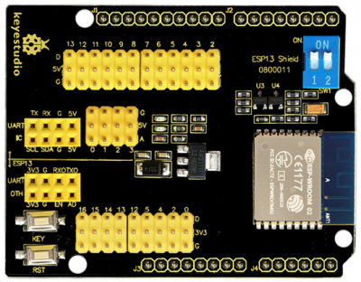

## 1. Introduction

Nowadays, WiFi is seen everywhere in our daily life and Arduino microcontrollers are getting more and more popular.

The keyestudio ESP13 shield is particularly designed for Arduino microcontrollers to connect the WiFi.It adopts industrial grade chip ESP8266. It is ESP-13 with metal shield, with strong anti-interference ability.

The pin is compatible with the main control board such as Arduino Uno and Mega2560. Meanwhile, it uses the voltage conversion chip when connecting the Arduino MCU, which compatibles with 3.3V and 5V.

The serial port of the shield is controlled by a dual-dial switch, so that it can be used alone as an Arduino MCU expansion board or as an ESP8266 shield.

It configures WiFi and serial parameters based on Web Server. It can not only be used as an independent ESP8266 development board, downloading official AT command firmware, NodeMCU open source firmware and so on, but also can be used as a stand-alone Arduino UNO shield, with all lead out pins.

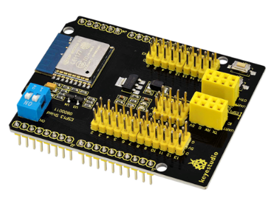

## 2. Technical Details

- Support wireless 802.11 b/g/n standards.
- Support STA/AP working modes
- Built-in TCP/IP protocol stack, able to configure a socket.
- Support standard TCP/UDP Server and Client.
- The serial port baud rate supporting 1200/2400/4800/9600/19200/38400/57600/74800/115200 bps.
- Serial port data: 5/6/7/8 bits
- Serial Parity check: None
- Serial port stop bit: 1/2 bit
- Standard Arduino Uno/Mega pin pitch
- Breaks out Arduino Pin 2/3/4/5/6/7/8/9/10/11/12/13
- ESP8266 GPIO 0/2/4/5/9/10/12/13/14/15/16/ADC/EN/UART/ TX/UART RX/UART
- RESET button
- KEY button for multiplexing configuration function
- Two DIP switches enable extended switching between the Arduino and ESP8266 serial ports.
- WiFi operating current: continuous transmission≈700mA(200mA MAX), standby <200uA.
- Wireless transmission rate: 110-460800bps
- Working temperature: -40℃ ~ +125℃
- Dimensions: 69mm * 54mm * 19mm
- Weight: 22.7g

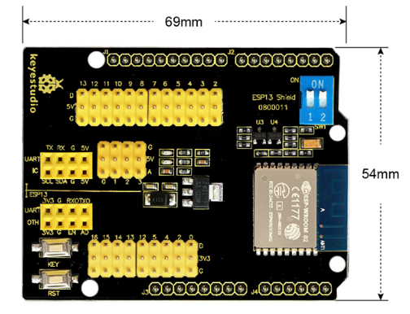

## 3. Pins

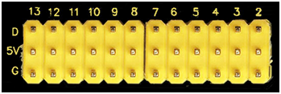

**G:** GND
**5V:** 5V power output
**D：**Arduino digital pins（D2-D13）

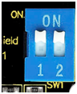

**Controlling switch:** connecting ESP8266 and Arduino serial port

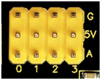

**G:**GND
**5V:** 5V power output
**D：**Arduino analog pins（A0-A3）

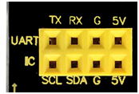

**UART:** connecting arduino serial communication（5V, GND, RX, TX）
**IIC:** connecting arduino IIC communication（5V, GND, SDA, SCL）

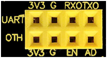

**UART:** connecting ESP8266 serial communication（3.3V, GND, RX, TX）
**OTH**
**3V3:** 3.3V power output
**G:** GND
**EN:** ESP8266 EN
**AD:** ESP8266 AD

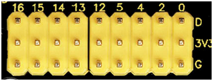

**G:** GND
**3V3:** 3.3V power output
**D:** breaks out ESP8266 GPIO（GPIO 0/2/4/5/12/13/14/15/16）

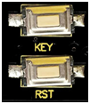

**Buttons for burning the firmware**
(click flash to enter program wait mode, keep the RST button pressed and then press the KEY button and release, wait for a moment, programming process bar starts to roll.)

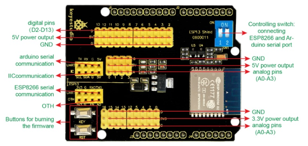

## 4. Use Method

The shield is default by firmware supporting AT command. And the firmware version is v0.9.5.2 AT Firmware. Open the serial debugging tool, set well as below, click to test AT, the board will return OK. Serial communication between Arduino UNO and the shield.

**Test Code:**

```c
void setup() 
{
 Serial.begin(115200);
 delay(100);
 Serial.println("AT");
 delay(5000); 
 Serial.println("AT+CWMODE=3");   //mode:3 is transparent transmission  STA+AP
 delay(5000); 
 Serial.println("AT+RST");   //reset 
 delay(5000);
 //***************************** change WiFi name
 Serial.println("AT+CWSAP=\"xingxing\",\"123456789\",11,0");  // change  WiFi name as xingxing，password 123456789
 delay(5000);
 //*****************************connecting WIFI
 // Serial.println("AT+CWJAP=\"xingxing\",\"123456789\"");  // connecting to wifi
 //delay(5000); 
 //Serial.println("AT+CIFSR");   //check IP
 //delay(5000); 
 //Serial.println("AT+CIPMUX=0");   // set to single link mode
 //delay(5000); 
 //Serial.println("AT+CIPMODE=1");   // set to passthrough mode 
 //delay(5000); 
 //Serial.println("AT+CIPSTART=\"TCP\",\"172.19.27.1\",8080"); // connecting to server
 //delay(5000);
 //Serial.println("AT+CIPSEND");   // start passthrough mode
 //delay(5000);
}

void loop() 
{
 //Serial.println("hello!");
 delay(1000);  
}
```

In the code, we have set the wifi working mode, name and password by AT command. If need to change the mode, can select the corresponding AT command from debugging tool .

Upload well the code to Arduino UNO, stack the shield onto UNO board and power on, it will directly connect the WIFI on the phone without password. Shown below.

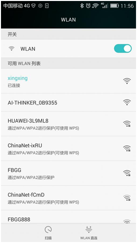

## 5. Method for Programming the Firmware

Powering the Arduino control board, in the range of DC7-12V, separately connect the pins GND, 5V to GND, 5V of WIFI shield.

| FT232 module | WIFI shield |
| ------------ | ----------- |
| TXD          | Digital 1   |
| RXD          | Digital 0   |
| GND          | GND         |

1. **Open the ESP8266Flasher programmer, select the COM port.**

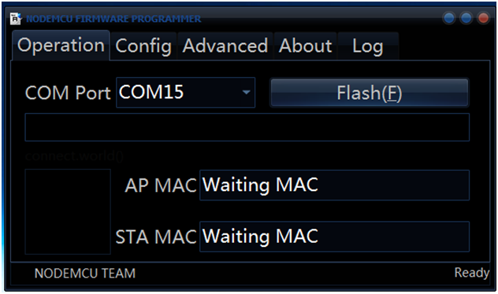

2. **Click Config,select the firmware version ESP8266_Doit_ser2net_20150723.**

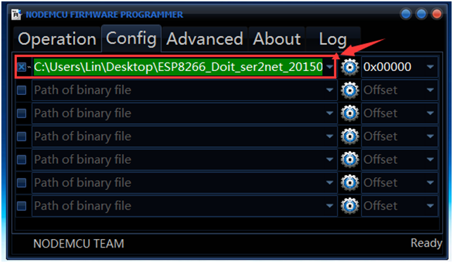

3.  **Click Operation, click Flash****, press the button RST, then press the button KEY, start to program the firmware shown below.**

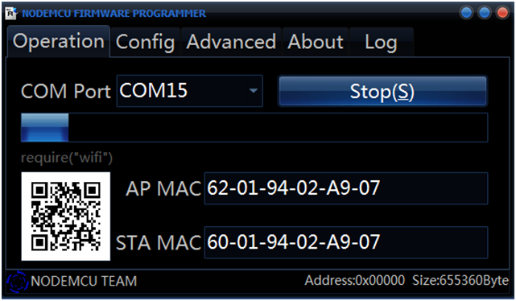

## 6. Configuration Method

Program well the firmware, power off to restart. Powering the Arduino board, in the range of DC7-12V, separately connect the pins GND, 5V to GND, 5V of wifi shield, then open the WIFI on the phone.

Search the WIFI, find **DoitWiFi_Config**, connect it with the password **12345678**.

Enter the WiFi shield address： [http://192.168.4.1](http://192.168.4.1/) on the browser. Shown below.

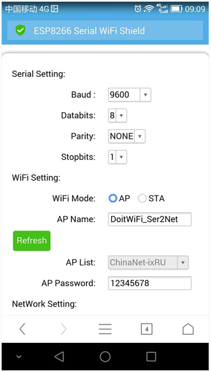